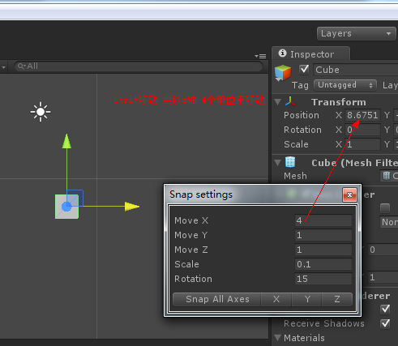
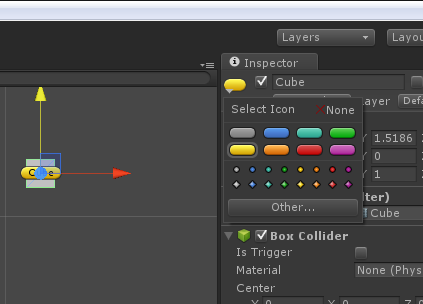

## 一、近距离查看游戏对象
&emsp;&emsp;在Hierarchy视图中选择游戏对象，然后在Scene视图中按快捷键“**F**”来近距离查看该游戏对象。

## 二、游戏对象不在主摄像头中？
&emsp;&emsp;Hierarchy中双击选择需要显示的游戏对象，再单击Main Camera选中，最后**Ctrl+Shift+F**键盘即可。

## 三、旋转视图
&emsp;&emsp;**Alt键 + 鼠标左键** 可以任意拖动鼠标来旋转视图。如果x，y，z坐标轴恢复不了，可以先单击X轴（Y、Z）再鼠标右键选择“Free” 最后通过这个来调试。

## 四、缩放视图
&emsp;&emsp;滚动鼠标中键可以缩放整体视图。

## 五、变换工具栏
&emsp;&emsp;拖动工具：Q  移动工具：W  旋转工具:快捷键为 E  缩放工具:R

## 六、MonoDevelop几个常用的快捷键

**CTRL+K**  删除光标所在行的该行后面的代码

**CTRL + ALT +C**  注释/不注释该行

**CTRL+ DOWN**  像鼠标滚轮一样向下拖

**CTRL + UP** 像鼠标滚轮一样向上拖

**CTRL + F**  查找该脚本

**CTRL + SHIFT + F** 查找全部脚本

**CTRL + H** 替换代码

CTRL + SHIFT +W 关掉所有脚本

## 七、飞行模式
（透视模式下正交模式下是不行的）：（第一人称视角看） 
**鼠标右键+WSAD** 可以前后左右
**鼠标右键+QE**上下

 

## 八、按住Ctrl键移动物体会以一定的增量来移动物体

　Edit-Snap Setting 增量的单位的设置，包括移动和缩放
　
　
## 九、顶点吸附 选中物体，按键盘V键，就可以看到物体的顶点：可以将一个或多个物体以一个顶点为原点吸附到另一个物体的一个顶点上。

     关闭顶点吸附：Shift+V

## 十、给物体添加图标
