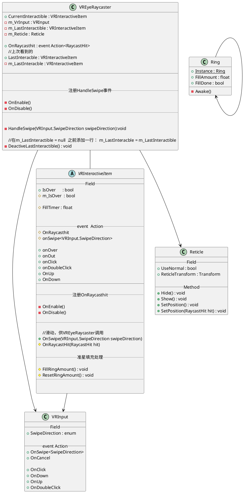

# VR交互

```plantuml!
@startuml

VREyeRaycaster --> VRInput
VREyeRaycaster -- VRInteractiveItem
VREyeRaycaster --> Reticle
VRInteractiveItem --> VRInput

Ring --> Ring


class VREyeRaycaster{ 
    +CurrentInteractible : VRInteractiveItem
    -m_VrInput : VRInput
    -m_LastInteractible : VRInteractiveItem
    -m_Reticle : Reticle
    
    +OnRaycasthit : event Action<RaycastHit>
    //上次看到的
    +LastInteracble : VRInteractiveItem
    -m_LastInteracble : VRInteractiveItem 
          
____

         
..注册HandleSwipe事件..

    -OnEnable()
    -OnDisable()    
....
    
    
    -HandleSwipe(VRInput.SwipeDirection swipeDirection):void
    
    //在m_LastInteractible = null  之前添加一行： m_LastInteracble = m_LastInteractible
    -DeactiveLastInteractible() : void
}

abstract class VRInteractiveItem{
__Field__
    +IsOver      : bool
    #m_IsOver  : bool
    
    #FillTimer : float     
    
    
..event  Action..
    #OnRaycasthit
    #onSwipe<VRInput.SwipeDirection> 
        
    +onOver
    +onOut
    +onClick
    +onDoubleClick
    +OnUp
    +OnDown
__
        
..注册OnRaycasthit..
    
    -OnEnable()
    -OnDisable()

..
        
    //滑动，供VREyeRaycaster调用
    +OnSwipe(VRInput.SwipeDirection swipeDirection)    
    #OnRaycastHit(RaycastHit hit)        
    
..准星填充处理..
        
    #FillRingAmount() : void
    #ResetRingAmount() : void
..
    
    
}

class VRInput{
__Field__
    +SwipeDirection : enum

__event Action__
    +OnSwipe<SwipeDirection>
    +OnCancel
    
    +OnClick
    +OnDown
    +OnUp
    +OnDoubleClick     
}

class Reticle{
__Field__
    +UseNormal : bool
    +ReticleTransform : Transform
        
__Method__
    +Hide() : void
    +Show() : void
    +SetPosition() : void
    +SetPosition(RaycastHit hit) : void        
}

class Ring{
    +{static}Instance : Ring
    +FillAmount : float
    +FillDone : bool
    
    -Awake()
}
@enduml
```